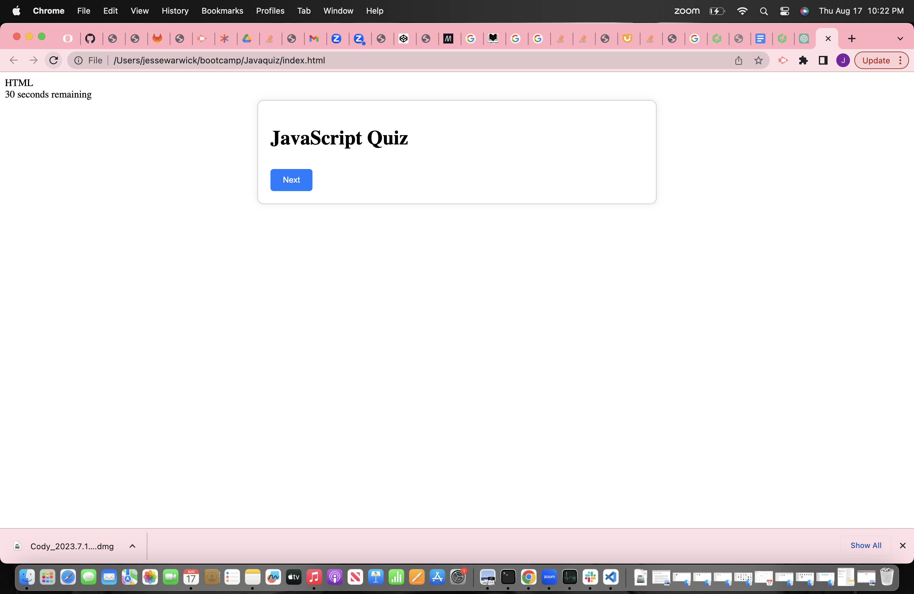

# Javaquiz
Homework 

https://github.com/jcwarwick/Javaquiz
https://jcwarwick.github.io/Javaquiz/

 in this project we were tasked to make a quiz on java script to show our understanding of APIs and traversing the DOM. This is a small quiz with a running timer that will double as your final score, every correct answer is +10 seconds and very incorrect answer is -10 seconds. after you are done you are presented with a text box for your initals and your score. click the submit button and those will save to local storage 